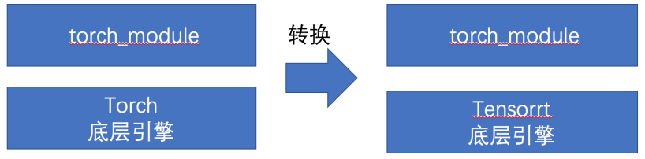
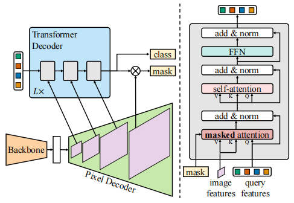
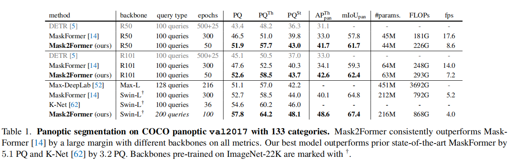
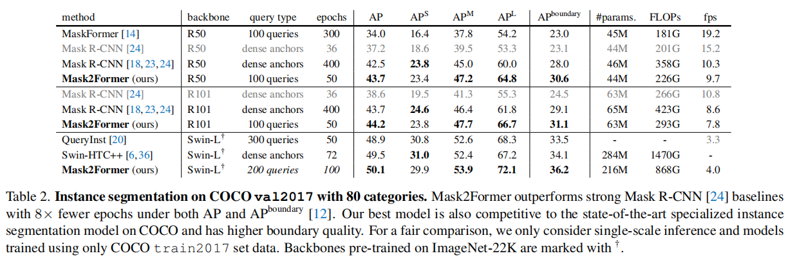

## 总述

- **优化模型名称**：[**Masked-attention Mask Transformer for Universal Image Segmentation**](https://github.com/facebookresearch/Mask2Former.git) 

- 项目主要贡献
	- 基于TensorRT 在Nvidia GPU 平台实现了Mask2Former模型的转换和加速
	- 利用TensorRT加速技术实现在半精度模式下的运算性能提升，并且控制精度损失在合理范围内
	- **本方法基于torch_tensorrt进行开发，可以直接将pytorch模型的底层计算过程直接迁移到TensorRT上，让用户在使用pytorch接口的同时可以使用TensorRT提高模型推理速度，相对于传统onnx转换tensort方法，本方法对用户更加方便快捷，降低用户的开发量**。对于未来工程化部署提供了一种思路，而这一点也是我们本次工作的核心亮点
	
	
	
	- 提供了在Docker中的代码编译、运行步骤的完整说明


## 原始模型

### 模型简介

- **论文地址**：https://arxiv.org/abs/2112.01527

- **模型概述**：我们选择的优化模型为Mask2Former是近期语义分割领域具有标志性的成果之一，也是第一个可以将语义分割、实例分割、全景分割进行统一的Transformer架构。其文中所提出的mask attention给Transformer注入了一些新的思路，相较于MaskFormer其结构更加精简，并且通过特征采样的设计有效的降低了模型训练时的计算复杂度，通过多尺度特征的加入使得模型能够更好的处理小目标的分割问题。

- **模型效果**：

	|        Segmentation Task        | Performance |
	| :-----------------------------: | :---------: |
	|  Panoptic Segmentation (COCO)   |   57.8 PQ   |
	|  Instance Segmentation (COCO):  |   50.1 AP   |
	| Semantic Segmentation (ADE20K): |  57.7 mIoU  |

- **模型的总体结构**







​	

​	Mask2Former总体沿用了MaskFormer 的架构，但是在Mask2Former中提出了一种新的基于masked attention 的 Tranformer decoder代替了stand cross-attention，并且为了更好的处理小对象，Mask2Former使用了多尺度策略来更好的利用高分辨率特征。从消融实验结果来看，其对各类型分割任务进行了统一，并均取得了非常不错的效果。

​	Mask2Former的主要构成模块列举如下：

1. Backbone：Swin Transformer / Resnet50 / Resnet101（multi-scale）		
2. Pixel Decoder: Multi-scale Deformable Attention (MSDeformAttn)
3. Transformer Decoder: Decoder with masked attention


### 模型优化的难点

1. Mask2Former不支持直接对整个模型导出ONNX，其中有非常多ONNX所不支持的算子
2. Multi-scale Deformable Attention没有现成的Plugin的实现和相关Tensorrt的转换参考
3. Decoder with masked attention 没有现成的Plugin的实现和相关Tensorrt 的转换参考
4. 原模型的代码接口大部分为字典组成，需要手动将其修改成非字典形式
5. 原模型中deformableAttn未注册到torch_script中，torch_tensorrt无法从libtorch中获取该算子的scheme，需要手工将其注册到torch_script


## 优化过程

- #### **TensorRT算子层面工作：**

	- GroupNormPlugin算子
	- 添加DeformableAttnPlugin
	- 添加layerNormPlugin

- #### **torch_tensorrt改进工作**：

	- 添加einsum算子调度层
	- 添加torch.index_select层
	- 增加支持多个输出的torch模型转换
	- 优化torch_tensorrt调用trt8.4的identy层无法转换精度
	- 优化torch_tensorrt调用addElementWise时由于tensor精度不同造成转换失败

- #### 模型层面的改进工作

	- 将tensor切片组装过程移到pytorch中进行计算
	- 将deformableAttn所需要的reference_point提前计算完毕
	- 防止模型重复计算


## 	优化效果

### 性能和精度对比

在A10显卡下测试结果如下表所示：

|    模型    |          Method           | 耗时/img | 绝对误差 | 相对误差 |
| :--------: | :-----------------------: | :------: | :------: | :------: |
| MaskFormer | trt8.4+torch_trt_universe | 262.25ms |   1e-1   |   4e-4   |
| MaskFormer |        Pytorch10.2        | 322.03ms |    -     |    -     |
|  Backbone  | trt8.4+torch_trt_universe |  5.37ms  |    -     |    -     |
|  Backbone  |        Pytorch10.2        | 23.52ms  |    -     |    -     |
|  Encoder   | trt8.4+torch_trt_universe | 24.58ms  |    -     |    -     |
|  Encoder   |        Pytorch10.2        | 41.05ms  |    -     |    -     |

备注：MaskFormer包括Backbone、Encoder、Decoder以及后处理，torch_trt_universe为个人维护的torch_tensorrt

从上述运行优化结果可以看出，我们的模型在backbone上将推理时间从23.52ms提升到了5.37ms；在Encoder部分（deformable attention部分）将推理时间从41.05ms提升到了24.58ms，均实现了非常大幅度的提升；decoder部分由于trt算子内部的等待时间过长，很遗憾未能提供相应实验结果。

## 代码运行流程

- 搭建docker运行环境

	```shell
	docker pull p517332051/nvidia_trt_test:v4
	```

- 启动docker镜像

	```shell
	#!/bin/bash
	set -x
	set -e
	
	ROOT_DIR=$(cd "$(dirname "$0")";pwd)
	
	DOCKER_IMAGE="p517332051/nvidia_trt_testi:v1"
	
	export NV_GPU="0,1,2,3,4,5,6,7"
	
	docker run --gpus '"device=0"' -v /data0:/data0 --shm-size 128g  -v /home:/home -it  $DOCKER_IMAGE bash
	```

- 激活编译环境

	```shell
	conda activate wenet
	```

- 进入相应目录并编译TensorRT相关库

	```shell
	cd /workspace/Torch-TensorRT-universe
	mkdir build
	cd build
	cmake -DCMAKE_BUILD_TYPE=RELEASE ..
	make -j8
	```

- 运行测试脚本

	```shell
	sh /workspace/Mask2Former/run_test.sh
	```

	（这里运行的测试结果为做5次前向的时间~）
	
	

## 文件说明

- Docker /workspace下主要文件夹说明
	- 3rd_lib： 第三方包，包括TRT8.4，OpenCV等
	- checkpoint：模型的对应权重
	- test_img_new： 测试图片
	- Mask2Former文件夹：模型接口的python代码
		- Mask2Former/run_test.sh：测试精度脚本
	- Torch-TensorRT-universe文件夹：Torch_Tensorrt C++代码
		- Torch-TensorRT-universe/core/plugins/impl: plugin相关代码
	- complite_lib：Torch_Tensorrt 编出来的so文件
	- wenet：conda 环境


## TensorRT  8.4 Bug 提交

- 在TensorRT 8.4 环境下转换编译MaskerFormer的decoder模块会出现卡死或过长现象(超过6小时)，但是在cuda10.2，TensorRT 8.2的环境下编译正常，目前已将该模型和log已经提交给主办方。

